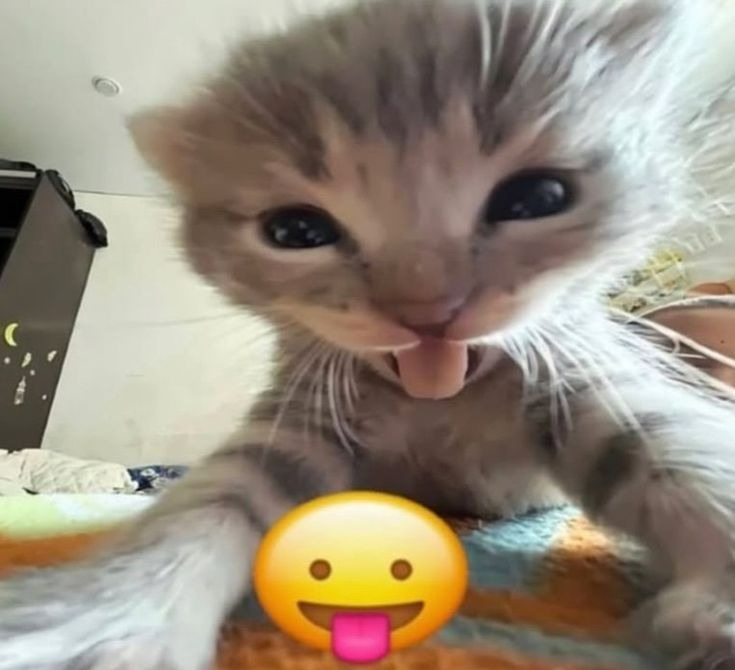

# Go Programming - TYBCA Sem VI 😼

<p align="center">
  
</p>

---

## yo what's up 👋

alright guys, use my repo for all the Go lab codes and just **chill the fuck out** in labs. no stress, no panic, just vibes. 😎

i got you covered with all 6 assignments. just copy, run, submit, and enjoy your lab time doing literally anything else.

---

## what's inside 📦

| Assignment | Topic | Vibe Check |
|------------|-------|------------|
| 1 | Intro to Go | � ezpz |
| 2 | Functions | � still chill |
| 3 | Arrays & Slices | � manageable |
| 4 | Methods & Interfaces | � we got this |
| 5 | Goroutines & Channels | � trust the code |
| 6 | Packages & Files | ✨ done and dusted |

---

## how to use 🚀

```bash
go run setaq1.go
```

that's it. that's literally it. now go touch grass or something.

---

<p align="center">
  
</p>

---

## rules for the homies 🤝

1. **star the repo** ⭐ - show some love
2. **don't all submit at the same time** - be smart about it
3. **change some variable names** - `num1` → `number1` → `n1` - you get it
4. **if teacher asks, you wrote it** - confidence is key �

---

## assignment breakdown

```
assignment1/  →  Basics, loops, pointers
assignment2/  →  Functions, recursion, defer
assignment3/  →  Arrays, slices, structs
assignment4/  →  Methods, interfaces
assignment5/  →  Goroutines, channels
assignment6/  →  Packages, files, testing
```

**52 programs total.** all working. all tested. you're welcome.

---

<p align="center">
  
</p>

---

## final words

stop stressing. the code is here. the labs are easy now.

go enjoy your college life. 🎓🍕

---

<p align="center">
  <b>made with love for the boys 💙</b>
</p>
